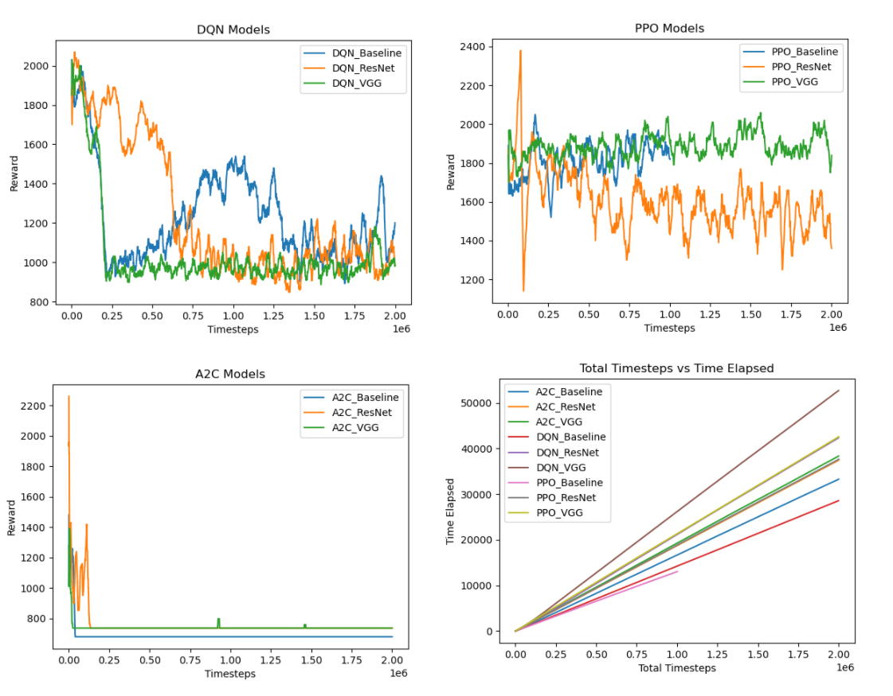
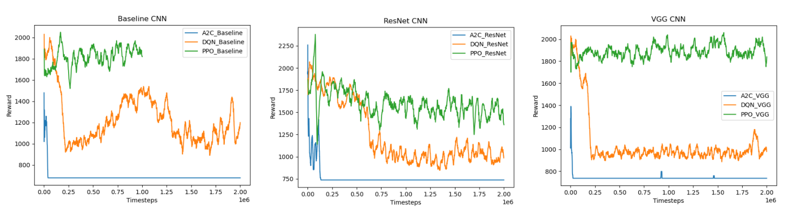

# Mario-RL

Our project targets at exploring the performance of different agents and CNNs about the video game Super Mario (SuperMarioBros-v0).

Reference:

[1] [https://pytorch.org/tutorials/intermediate/mario_rl_tutorial.html](https://pytorch.org/tutorials/intermediate/mario_rl_tutorial.html)

[2] [https://github.com/yumouwei/super-mario-bros-reinforcement-learning](https://github.com/yumouwei/super-mario-bros-reinforcement-learning)

# Experiment Setting

Specifically, we have experimented with the following settings:

**Agents**: `DQN`, `PPO`, `A2C` (from stable baseline 3)

**CNNs**: `Simple CNN(our baseline)`, `ResNet`, `VGG`

The results would be a comprehensive **qualitative** and **quantitative** analysis of their performance on the Super Mario game.'

## Reward Space

The reward is a 5-dimensional vector:

* 0: How far Mario moved in the x position
* 1: Time penalty for how much time has passed between two time steps
* 2: -25 if Mario died, 0 otherwise
* 3: +100 if Mario collected coins, else 0
* 4: Points for killing an enemy

## Action & State Space

To simplify the action space we use, we choose only two actions:

**Action Space**: ["right", "right" & "jump"\]

**State Space**: The simulated Pixel-based game screen

# Environment Setup

Python Version: `python==3.9`

Requirements: `pip install -r requirements.txt`

# Run on command line

```python
python main.py --agent DQN --cnn ResNet --total_timesteps 10000000
```

# Argument Settings

## Primary Arguments

* `--agent`: Specifies the type of RL agent to use. Default is `DQN`. Options:
  * `DQN` - Deep Q-Network
  * `PPO` - Proximal Policy Optimization
  * `A2C` - Advantage Actor-Critic
* `--cnn`: Type of CNN architecture used for processing the game frames. Default is `Baseline`. Options:
  * `Baseline` - Basic CNN architecture
  * `ResNet` - Residual Network
  * `VGG` - VGG network
* ## Other Arguments
* `--skip_frame_num`: Number of frames to skip for each action taken by the agent. Default is `4`.
* `--resize`: Resize the game frames to a square image of this dimension (in pixels). Default is `84`.
* `--gray`: Whether to convert the game frames to grayscale. This can reduce computational requirements. Set to `True` by default.
* `--model_save_path`: Directory path where the trained model will be saved. Default is `./model_save`.
* `--total_timesteps`: Total number of environment steps (samples) the agent will be trained on. Default is `25,000`.

# Train for all agents and all models

```bash
bash run.sh
```

# Result Data

We collected the following data in training:

1. Timesteps - actual steps we trained on the model within the episodes
2. Average rewards - the average reward for the episodes between the time steps noted
3. Time elapsed - the time used since the start of the train to the time at the corresponding time steps noted
4. Model - the trained model at the end of the train

We then do the following for the visualization

1. Moving rewards for same agents with different CNNs
2. Moving rewards for same CNNs with different agents
3. Time elapsed for different CNNs and agents.
4. Generated demo videos for models

We use these methods to perform a **qualitative** and **quantitative** analysis of our agents and CNNs

1. Rewards
2. Time used
3. Video performance
4. Convergence rate

# Primary Results





# Example demo videos

Here we compared the performance of DQN, PPO, A2C with ResNet as an example, we could find that PPO has the more promising result from the video

**DQN**


**PPO**


**A2C**


# Conclusion

In the graphs, we can notice that A2C is soon dropped and stabilized. It might because the agent and cnn policy is not properly set and the model is soon trapped into a local optima. For DQN, we can see there is a high variance and the rewards fluctuate around 1200. For PPO, there is a lower variance and the rewards are around 1800.

DQN uses replay buffer to randomly sample the past experiences. This randomness can cause a high variance in the learning stage (as shown in the plot of baseline comparison between agents), given the experience varies from very good to very bad.

DQN also adopts the ϵ-greedy in exploration. We can see in all three plots (fixing the CNNs while varying agents), DQN exhibits much higher reward drop compared to PPO, which can potentially be due to the exploitation possibility is higher (i.e. ϵ is set larger) in an early stage.

PPO generally has the highest episode mean reward in the learning process, which is likely because PPO benefits from the direct search for the optimal policy. This ensures PPO to maximize the reward function.

PPO also has regularization of the policy function. This can cause PPO to perform stable learning, thus having a lower variance.

We can conclude that PPO have higher rewards than DQN initially is because it is focus on the true objectives of RL. 

Due to limitations, we can only conclude that the simple CNN is trained faster than the Resnet and VGG, because it is built simpler. We can also observe from the graph that PPO is faster than DQN. 

# Limitation

1. Given a limited access to computing resources and a bunch of agents and CNNs we need to compare, we are only able to train 2 million time steps (about 5000 episodes), which is smaller than the recommended 40000 episodes.
2. Preprocessing could be further explored to find optimal parameters.
3. We could customize our agents and cnn to make codes more efficients
4. Pretrained model could be added to speed up the training.
