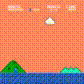

# Mario-RL

Our project targets at exploring the performance of different agents and CNNs about the video game Super Mario (SuperMarioBros-v0).

Reference:

[1] [https://pytorch.org/tutorials/intermediate/mario_rl_tutorial.html](https://pytorch.org/tutorials/intermediate/mario_rl_tutorial.html)

[2] [https://github.com/yumouwei/super-mario-bros-reinforcement-learning](https://github.com/yumouwei/super-mario-bros-reinforcement-learning)

# Experiment Setting

Specifically, we have experimented with the following settings:

**Agents**: `DQN`, `PPO`, `A2C` (from stable baseline 3)

**CNNs**: `Simple CNN(our baseline)`, `ResNet`, `VGG`

The results would be a comprehensive **qualitative** and **quantitative** analysis of their performance on the Super Mario game.'

## Reward Space

The reward is a 5-dimensional vector:

* 0: How far Mario moved in the x position
* 1: Time penalty for how much time has passed between two time steps
* 2: -25 if Mario died, 0 otherwise
* 3: +100 if Mario collected coins, else 0
* 4: Points for killing an enemy

## Action & State Space

To simplify the action space we use, we choose only two actions:

**Action Space**: ["right", "right" & "jump"\]

**State Space**: The simulated Pixel-based game screen

# Environment Setup

Python Version: `python==3.9`

Requirements: `pip install -r requirements.txt`

# Run on command line

```python
python main.py --agent DQN --cnn ResNet --total_timesteps 10000000
```

# Argument Settings

## Primary Arguments

* `--agent`: Specifies the type of RL agent to use. Default is `DQN`. Options:
  * `DQN` - Deep Q-Network
  * `PPO` - Proximal Policy Optimization
  * `A2C` - Advantage Actor-Critic
* `--cnn`: Type of CNN architecture used for processing the game frames. Default is `Baseline`. Options:
  * `Baseline` - Basic CNN architecture
  * `ResNet` - Residual Network
  * `VGG` - VGG network
* ## Other Arguments
* `--skip_frame_num`: Number of frames to skip for each action taken by the agent. Default is `4`.
* `--resize`: Resize the game frames to a square image of this dimension (in pixels). Default is `84`.
* `--gray`: Whether to convert the game frames to grayscale. This can reduce computational requirements. Set to `True` by default.
* `--model_save_path`: Directory path where the trained model will be saved. Default is `./model_save`.
* `--total_timesteps`: Total number of environment steps (samples) the agent will be trained on. Default is `25,000`.

# Train for all agents and all models

```bash
bash run.sh
```

# Result Data

We collected the following data in training:

1. Timesteps - actual steps we trained on the model within the episodes
2. Average rewards - the average reward for the episodes between the time steps noted
3. Time elapsed - the time used since the start of the train to the time at the corresponding time steps noted
4. Model - the trained model at the end of the train

We then do the following for the visualization

1. Moving rewards for same agents with different CNNs
2. Moving rewards for same CNNs with different agents
3. Time elapsed for different CNNs and agents.
4. Generated demo videos for models

We use these methods to perform a **qualitative** and **quantitative** analysis of our agents and CNNs

1. Rewards
2. Time used
3. Video performance
4. Convergence rate

# Primary Results


# Example demo videos

Here we compared the performance of DQN, PPO, A2C with ResNet as an example, we could find that PPO has the more promising result from the video

**DQN**



**PPO**

 

**A2C**

 

# Conclusion

# Limitation

1. Given a limited access to computing resources and a bunch of agents and CNNs we need to compare, we are only able to train 2 million time steps (about 5000 episodes), which is smaller than the recommended 40000 episodes.
2. Preprocessing could be further explored to find optimal parameters.
3. We could customize our agents and cnn to make codes more efficients
4. Pretrained model could be added to speed up the training.
